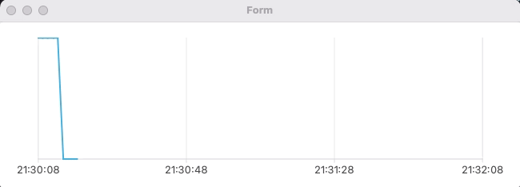

## Building HTS

### Chart GUI
- Create QThread that receive coin data and send to the Chart GUI
```python
class PriceWorker(QThread):
    # get the data from bithumb and send to ChartWidget
    dataSent = pyqtSignal(float)

    def __init__(self, ticker):
        super().__init__()
        self.ticker = ticker
        self.alive = True

    def run(self):
        while self.alive:
            try:
                data = pybithumb.get_current_price(self.ticker)
                self.dataSent.emit(data)
            except:
                pass
            time.sleep(1)

    def close(self):
        self.alive = False
```

- Create a Chart GUI
    ```python
    class ChartWidget(QWidget):
        def __init__(self, parent=None, ticker="BTC"):
            super().__init__(parent)
            # set-up Chart display
            ...

            ### set X, Y axis ###
            
            # set X-axis to date time
            axisX = QDateTimeAxis()
            axisX.setFormat("hh:mm:ss")
            axisX.setTickCount(4)   # set 4 datetime to appear
            dt = QDateTime.currentDateTime()
            axisX.setRange(dt, dt.addSecs(self.viewLimit))

            # set Y-axis
            axisY = QValueAxis()
            axisY.setVisible(False)

            # connect X, Y axis with the recieved data
            self.priceChart.addAxis(axisX, Qt.AlignBottom)
            self.priceChart.addAxis(axisY, Qt.AlignRight)
            self.priceData.attachAxis(axisX)
            self.priceData.attachAxis(axisY)
            self.priceChart.layout().setContentsMargins(0, 0, 0, 0)

            self.priceView.setChart(self.priceChart)
            self.priceView.setRenderHints(QPainter.Antialiasing)

            # create QThread Object
            self.pw = PriceWorker(ticker)
            self.pw.dataSent.connect(self.appendData)
            self.pw.start()

        def closeEvent(self, event):
            # close PriceWorker QThread before end of app
            self.pw.close()

        def appendData(self, currPrice):
            # append data to plot on the chart
            if len(self.priceData) == self.viewLimit:
                self.priceData.remove(0)    # remove old data
            dt = QDateTime.currentDateTime()
            self.priceData.append(dt.toMSecsSinceEpoch(), currPrice)
            self.__updateAxis()

        def __updateAxis(self):
            # moderate X, Y axis in realtime
            pvs = self.priceData.pointsVector()  # pricedata to list
            dtStart = QDateTime.fromMSecsSinceEpoch(int(pvs[0].x()))
            if len(self.priceData) == self.viewLimit:
                dtLast = QDateTime.fromMSecsSinceEpoch(int(pvs[-1].x()))
            else:
                dtLast = dtStart.addSecs(self.viewLimit)

            ax = self.priceChart.axisX()
            ax.setRange(dtStart, dtLast)

            ay = self.priceChart.axisY()
            dataY = [v.y() for v in pvs]
            ay.setRange(min(dataY), max(dataY))
    ```
    