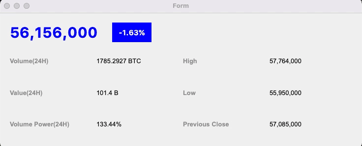

## Building HTS
- Each GUI UIs are created with _PyQt5 QtDesigner_


### Chart GUI

- Create QThread that receive coin data and send to the Chart GUI
    ```python
    class PriceWorker(QThread):
        # get the data from bithumb and send to ChartWidget
        dataSent = pyqtSignal(float)

        def __init__(self, ticker):
            super().__init__()
            self.ticker = ticker
            self.alive = True

        def run(self):
            while self.alive:
                try:
                    data = pybithumb.get_current_price(self.ticker)
                    self.dataSent.emit(data)
                except:
                    pass
                time.sleep(1)

        def close(self):
            self.alive = False
    ```

- Set up ChartWidget 
    ```python
    class ChartWidget(QWidget):
        def __init__(self, parent=None, ticker="BTC"):
            super().__init__(parent)
            # set-up Chart display
            ...

            ### set X, Y axis ###
            
            # set X-axis to date time
            axisX = QDateTimeAxis()
            axisX.setFormat("hh:mm:ss")
            axisX.setTickCount(4)   # set 4 datetime to appear
            dt = QDateTime.currentDateTime()
            axisX.setRange(dt, dt.addSecs(self.viewLimit))

            # set Y-axis
            axisY = QValueAxis()
            axisY.setVisible(False)

            # connect X, Y axis with the recieved data
            self.priceChart.addAxis(axisX, Qt.AlignBottom)
            self.priceChart.addAxis(axisY, Qt.AlignRight)
            self.priceData.attachAxis(axisX)
            self.priceData.attachAxis(axisY)
            self.priceChart.layout().setContentsMargins(0, 0, 0, 0)

            self.priceView.setChart(self.priceChart)
            self.priceView.setRenderHints(QPainter.Antialiasing)

            # create QThread Object
            self.pw = PriceWorker(ticker)
            self.pw.dataSent.connect(self.appendData)
            self.pw.start()

        def closeEvent(self, event):
            # close PriceWorker QThread before end of app
            self.pw.close()

        def appendData(self, currPrice):
            # append data to plot on the chart
            if len(self.priceData) == self.viewLimit:
                self.priceData.remove(0)    # remove old data
            dt = QDateTime.currentDateTime()
            self.priceData.append(dt.toMSecsSinceEpoch(), currPrice)
            self.__updateAxis()

        def __updateAxis(self):
            # moderate X, Y axis in realtime
            pvs = self.priceData.pointsVector()  # pricedata to list
            dtStart = QDateTime.fromMSecsSinceEpoch(int(pvs[0].x()))
            if len(self.priceData) == self.viewLimit:
                dtLast = QDateTime.fromMSecsSinceEpoch(int(pvs[-1].x()))
            else:
                dtLast = dtStart.addSecs(self.viewLimit)

            ax = self.priceChart.axisX()
            ax.setRange(dtStart, dtLast)

            ay = self.priceChart.axisY()
            dataY = [v.y() for v in pvs]
            ay.setRange(min(dataY), max(dataY))
    ```
    


### Orderbook GUI

- Create data receiver QThread for Orderbook
    ```python
    class OrderbookWorker(QThread):
        # get Ticker's orderbook data
        dataSent = pyqtSignal(dict)

        def __init__(self, ticker):
            super().__init__()
            self.ticker = ticker
            self.alive = True

        def run(self):
            while self.alive:
                try:
                    data = pybithumb.get_orderbook(self.ticker, limit=10)
                    self.dataSent.emit(data)
                except:
                    pass
                time.sleep(0.05)

        def close(self):
            self.alive = False
    ```
- Set up OrderbookWidget
    ```python
    class OrderbookWidget(QWidget):
        def __init__(self, parent=None, ticker="BTC"):
            super().__init__(parent)
            uic.loadUi(
                "resource/orderbook.ui", self)
            self.ticker = ticker

            # start Orderbook Thread
            self.ow = OrderbookWorker(self.ticker)
            self.ow.dataSent.connect(self.updateData)
            self.ow.start()

            for i in range(self.tableBids.rowCount()):
                ### BID ###
                # Price
                item_0 = QTableWidgetItem(str(""))
                item_0.setTextAlignment(Qt.AlignRight | Qt.AlignVCenter)
                self.tableAsks.setItem(i, 0, item_0)

                # Volume
                item_1 = QTableWidgetItem(str(""))
                item_1.setTextAlignment(Qt.AlignRight | Qt.AlignVCenter)
                self.tableAsks.setItem(i, 1, item_1)

                # Total - bar in Red
                item_2 = QProgressBar(self.tableAsks)
                item_2.setAlignment(Qt.AlignRight | Qt.AlignVCenter)
                item_2.setStyleSheet("""
                    QProgressBar {background-color: rgba(0, 0, 0, 0%); border: 1}
                    QProgressBar::Chunk {background-color: rgba(255, 0, 0, 50%); border: 1}
                """)
                self.tableAsks.setCellWidget(i, 2, item_2)

                ### ASK ###
                # Price
                item_0 = QTableWidgetItem(str(""))
                item_0.setTextAlignment(Qt.AlignRight | Qt.AlignVCenter)
                self.tableBids.setItem(i, 0, item_0)

                # Volume
                item_1 = QTableWidgetItem(str(""))
                item_1.setTextAlignment(Qt.AlignRight | Qt.AlignVCenter)
                self.tableBids.setItem(i, 1, item_1)

                # Total - bar in blue
                item_2 = QProgressBar(self.tableBids)
                item_2.setAlignment(Qt.AlignRight | Qt.AlignVCenter)
                # set layout with CSS
                item_2.setStyleSheet("""
                    QProgressBar {background-color: rgba(0, 0, 0, 0%); border: 1}
                    QProgressBar::Chunk {background-color: rgba(0, 255, 0, 40%); border: 1}
                """)
                self.tableBids.setCellWidget(i, 2, item_2)

        def updateData(self, data):
            tradingBidValues = []
            for v in data['bids']:
                tradingBidValues.append(int(v['price']*v['quantity']))
            tradingAskValues = []
            for v in data['asks']:
                tradingAskValues.append(int(v['price']*v['quantity']))
            # combine 2 lists and find max value
            maxtradingValue = max(tradingBidValues+tradingAskValues)

            # set each column for asks
            for i, v in enumerate(data['asks'][::-1]):
                item_0 = self.tableAsks.item(i, 0)
                item_0.setText(f"{v['price']:,}")
                item_1 = self.tableAsks.item(i, 1)
                item_1.setText(f"{v['quantity']:,}")
                item_2 = self.tableAsks.cellWidget(i, 2)
                item_2.setRange(0, maxtradingValue)
                item_2.setFormat(f"{tradingAskValues[i]:,}")
                item_2.setValue(tradingAskValues[i])

            # set each column for bids
            for i, v in enumerate(data['bids'][::-1]):
                item_0 = self.tableBids.item(i, 0)
                item_0.setText(f"{v['price']:,}")
                item_1 = self.tableBids.item(i, 1)
                item_1.setText(f"{v['quantity']:,}")
                item_2 = self.tableBids.cellWidget(i, 2)
                item_2.setRange(0, maxtradingValue)
                item_2.setFormat(f"{tradingBidValues[i]:,}")
                item_2.setValue(tradingBidValues[i])

        def closeEvent(self, event):
            self.ow.close()
    ```
    

### Overview GUI

- Create data receiver QThread for Overview
    ```python
    class OverViewWorker(QThread):
        # set multiple signals for 24H and MID events
        data24Sent = pyqtSignal(int, float, int, float, int, int)
        dataMidSent = pyqtSignal(int, float, float)

        def __init__(self, ticker):
            super().__init__()
            self.ticker = ticker
            self.alive = True

        def run(self):
            # subscribe websocket for 24H and MID for accurency
            self.wm = WebSocketManager(
                "ticker", [f"{self.ticker}_KRW"], ["24H", "MID"])
            while self.alive:
                try:
                    data = self.wm.get()
                    # received data is MID-data
                    if data['content']['tickType'] == "MID":
                        self.dataMidSent.emit(int(data['content']['closePrice']),
                                            float(data['content']['chgRate']),
                                            float(data['content']['volumePower']))
                    
                    # received data is 24H-data
                    else:
                        self.data24Sent.emit(int(data['content']['closePrice']),
                                            float(data['content']['volume']),
                                            int(data['content']['highPrice']),
                                            float(data['content']['value']),
                                            int(data['content']['lowPrice']),
                                            int(data['content']['prevClosePrice']))
                except:
                    pass

        def close(self):
            self.alive = False
            self.wm.terminate()
    ```
- Set up OverviewWidget
    ```python
    class OverviewWidget(QWidget):
        def __init__(self, parent=None, ticker="BTC"):
            super().__init__(parent)
            uic.loadUi("resource/overview.ui", self)
            self.ticker = ticker

            self.ovw = OverViewWorker(ticker)
            self.ovw.data24Sent.connect(self.fill24Data)
            self.ovw.dataMidSent.connect(self.fillMidData)
            self.ovw.start()

        # fill in 24H data
        def fill24Data(self, currPrice, volume, highPrice, value, lowPrice, prevClosePrice):
            self.label_1.setText(f"{currPrice:,}")
            self.label_4.setText(f"{volume:.4f} {self.ticker}")
            self.label_6.setText(f"{highPrice:,}")
            self.label_8.setText(f"{value/1000000000:,.1f} B")
            self.label_10.setText(f"{lowPrice:,}")
            self.label_14.setText(f"{prevClosePrice:,}")
            self.__updateStyle()
        
        # fill in MID data
        def fillMidData(self, currPrice, chgRate, volumePower):
            self.label_1.setText(f"{currPrice:,}")
            self.label_2.setText(f"{chgRate:+.2f}%")
            self.label_12.setText(f"{volumePower:.2f}%")
            self.__updateStyle()

        def __updateStyle(self):
            # color blue when rate is negative
            if '-' in self.label_2.text():
                self.label_1.setStyleSheet("color:blue;")
                self.label_2.setStyleSheet("background-color:blue;color:white")

            # color red when rate is positive
            else:
                self.label_1.setStyleSheet("color:red;")
                self.label_2.setStyleSheet("background-color:red;color:white")

        def closeEvent(self, event):
            self.ovw.close()
    ```
    