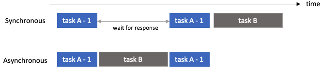

## Websocket for Synchronization

- Use **Websocket Modules** to solve delays between request and response

### Using _Websocket_ module with _asyncio_ module

- Using _asyncio_ module:
    - Allows handle asynchronous operations
        
    - Use _run_ function to handle many **coroutines**(= async functions)
        ```python
        import asyncio 
        
        async def async_func1():
            print("Hello")
        
        asyncio.run(async_func1())
        ```
    - Use _await_ keyword when calling other coroutines in a coroutine
        ```python
        import asyncio 
        
        async def make_coffee():
            print("Coffee Start")
            await asyncio.sleep(3)
            print("Coffee End")
        
        async def make_tea():
            print("Tea Start")
            await asyncio.sleep(5)
            print("Tea End")
        
        async def main():
            coro1 = make_coffee()
            coro2 = make_tea()
            await asyncio.gather(
                coro1, 
                coro2
            )
        
        print("Main Start")
        asyncio.run(main())
        print("Main End")


        ###### Result ######
        
        Main Start
        Coffee Start
        Tea Start
        Coffee End
        Tea End
        Main End
        ```

    - Coroutine can also return values
        ```python
        async def make_coffee():
            ...
            return "Coffee"
        
        async def make_tea():
            ...
            return "Tea"
        
        async def main():
            ...
            result = await asyncio.gather(
                coro1,
                coro2
            )
            print(result)
        ```

- Subscribe _Bithumb_ website to receive real-time coin data
    ```python
    async def bithumb_ws_clinet(q):
        # receive coin data with websocket, and put into a Queue

        uri = "wss://pubwss.bithumb.com/pub/ws"

        # set ping_interval as None to stop sending Ping frame to Bithumb server
        async with websockets.connect(uri, ping_interval=None) as websocket:

            # set the request format as JSON (<-dictionary)
            subscribe_fmt = {
                "type": "ticker",
                "symbols": ["BTC_KRW"],
                "tickTypes": ["1H"]
            }
            subscribe_data = json.dumps(subscribe_fmt)
            await websocket.send(subscribe_data)

            while True:
                # recieve data form the server
                data = await websocket.recv()
                data = json.loads(data)
                q.put(data)
    ```
